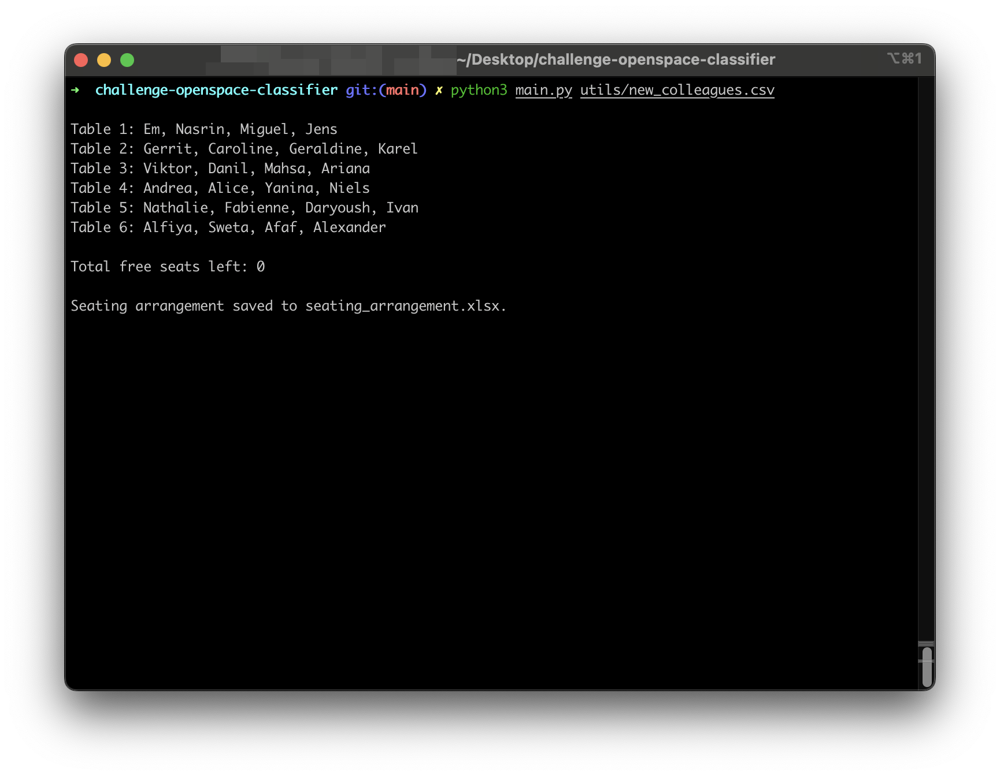

# **OpenSpace Organizer**

## Description

The OpenSpace Organizer is a Python-based tool designed to dynamically allocate seating arrangements in open office spaces or at events. Utilizing principles of Object-Oriented Programming (OOP), the tool aims to improve team interactions by randomly assigning seating positions, thus fostering a collaborative and inclusive environment.

## Installation

    git clone git@github.com:Danil-Zhuravlov/challenge-openspace-classifier.git
    cd challenge-openspace-classifier
    pip install -r requirements.txt

## Usage

### Running the Program

To run the program, navigate to the project directory in your terminal and execute the following command:

    python main.py <path_to_your_csv_file>

Replace <path_to_your_csv_file> with the actual path to your CSV file containing the names of the colleagues. For example:

    python main.py utils/new_colleagues.csv

This command initiates the program, which reads the list of names from the specified CSV file, randomly assigns seating arrangements, and displays the results along with any unassigned names and the number of free seats left.

### CSV File Format

The CSV file should be formatted with one name per line, as shown below:

    Will Smith
    Leonardo DiCaprio
    Bill Gates
    Morgan Freeman
    Barack Obama
    ...

Ensure there are no headers in the file for the program to function correctly.

## Visuals

The above image demonstrates a sample output of the seating arrangement.

## Timeline

Duration: 2 days

## Personal Situation

At BeCode, I'm part of a diverse group of over 20 students. Early on, we noticed a tendency to stick with familiar faces for group work, leading to our large group splitting into smaller, isolated clusters. This division made it challenging to fully embrace the collaborative and inclusive spirit we valued.

To address this, I developed the OpenSpace Organizer. This program randomly assigns seating to ensure everyone collaborates with each other over time. The goal was simple: to break down the invisible walls that kept us within comfort zones and to encourage new connections.

Since implementing the program, the change has been noticeable. We've started interacting more across the entire group, discovering new perspectives and forging stronger bonds. It's not just about sitting next to someone new; it's about creating a more cohesive and dynamic learning environment where everyone feels part of a unified team.

This tool is a testament to how a small shift in our daily routine can significantly impact our collective experience, making our group not just a collection of individuals but a closely-knit community.

## License

This project is licensed under the MIT License - see the [LICENSE.txt](LICENSE.txt) file for details.
